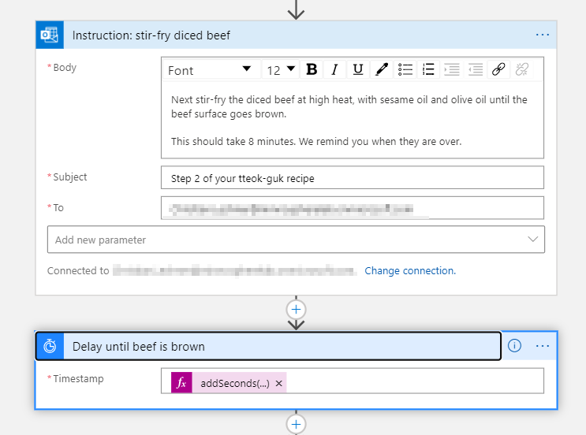

# Season of Serverless - Challenge Week 5

This repository contains the solution for the Season of Serverless Challenge week 5 aka "Tteok-guk for The New Year" via Azure Logic Apps

## Solution Components

The solution consists of an Azure Logic App that provides an HTTP endpoint that accepts two parameters in the JSON body of the request:

* `garaeTteokType` - put sliced here if you bought sliced garae-tteok or pass an empty string in the other case
* `noOfGuests` - put the number of guests here

The app will then deliver you the recipe based on the number of guests and guide you through the preparation of the soup by sending you emails including a corresponding waiting time (e. g. if you must water the garae-tteok) and approval emails (e. g. to notify the workflow when the beef is brown).

The graphical design looks like this.

You find the code view of the Logic App in the file [workflow.json](./workflow.json)

## Internal Design

### Remark with respect to delays

For the sake of not having to wait an eternity for the execution I adopted the delays as follows:

* Delay of 30 minutes is a delay of 90 seconds in the Logic App
* Delay of 30 minutes is a delay of 24 seconds in the Logic App

### Steps in the Logic App

#### __Preparation__

The entry point is a HTTP request received with the body described above.

Here is an example call to trigger the Azure Logic App for 8 guests and for the case of sliced garae-tteok.

Next we execute some initialization steps to extract the values from the request body and calculate the multiplier for the number of guests in order to calculate the amounts for the ingredients of the recipe.

#### __The Recipe__

Before starting with the cooking we send out the recipe with the amounts adopted to the number of guests. To do so we calculate the amounts for the single ingredients in parallel.

After the calculation we send out an email with the calculated amounts. We also must introdue a little dealy before the workflow continues as sometimes this email is delivered after the one of the next step.

The resulting email looks like this.

#### __The Cooking__

Next we must distinguish if the garae-tteok is _sliced_ or not. We do so by introducing a condition into the workflow.

In case we are in the _sliced_ branch we send out an email to water the garae-tteok for 30 minutes and to slice the spring onions. This is followed by the 30 minutes delay, before the next step is executed. The email looks like this.

In case we are in the _non-sliced_ branch we send out an email to slice the garae-tteok and the spring onions. As we do not know how fast the recipient is with the slicing, we send this email as an approval email. As soon as the slicing is done the cook can approve and the flwo continues. The approval email looks like this

Next i.e. after time out or approval we move on to the stir-fry the diced beef. We send out an email with the instructions and apply a delay of 8 minutes.

The cook receives an email like this.

As we cannot exactly say when the beef is ready, we send out an approval mail to confirm that the beef is really right and we can continue the work.

This is the email the cook has to approve for the diced beef.

After that the boiling starts. We send out an email with the instructions followed by a delay of 30 minutes

This is what the cook receives.

When the timer has passed and the workflow is picked up again, there is one last instruction that we send out via a regular email action.

The cook has now the last instructions before serving the soup.

Nothing more to say than 잘 먹겠습니다

## How to execute

As quite some email traffic is created, I will not publish the HTTP endpoint. The working logic app can be reproduced via the [workflow.json](./workflow.json) file in your own Azure Account. Make sure to replace the following Placeholders accordingly:

* `<PUT_YOUR_EMAIL_HERE>`
* `<YOUR_SUBSCRIPTION_ID>`
* `<YOUR_RESOURCE_GROUP>`
